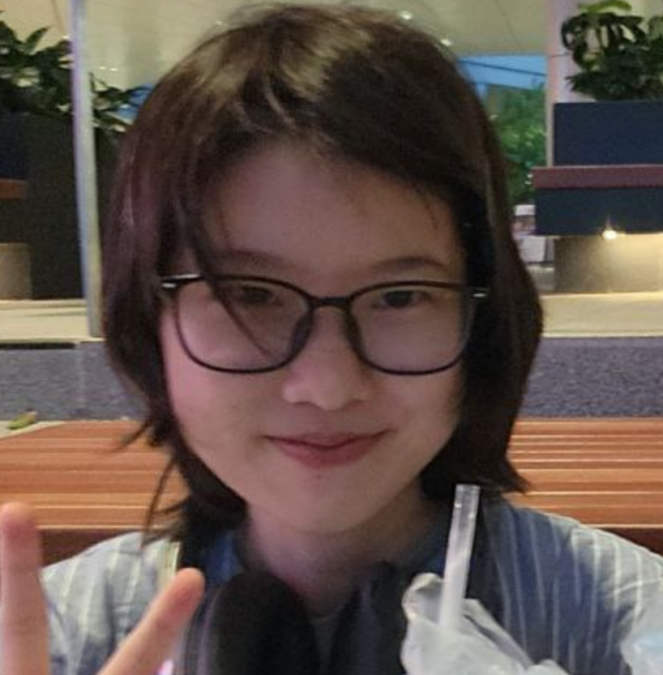

# About Us

We are a team based in the [School of Computing, National University of Singapore](http://www.comp.nus.edu.sg).

You can reach us at the email `seer[at]comp.nus.edu.sg`

## Project team

### Natalia Zhao

[[github](https://github.com/petelectron)]

* Role: Team Member

### Gao Wei Jie

[[github](http://github.com/emperorgaodi)]
[[portfolio]()]

* Role: Developer
* Responsibilities: -

### Johnny Doe

[[github](http://github.com/johndoe)] [[portfolio](team/johndoe.md)]

* Role: Developer
* Responsibilities: Data

### Jean Doe

[[github](http://github.com/johndoe)]
[[portfolio](team/johndoe.md)]

* Role: Developer
* Responsibilities: Dev Ops + Threading

### Hoang Tuan Minh

[[github](https://github.com/moonmertens)]

* Role: Team Member
